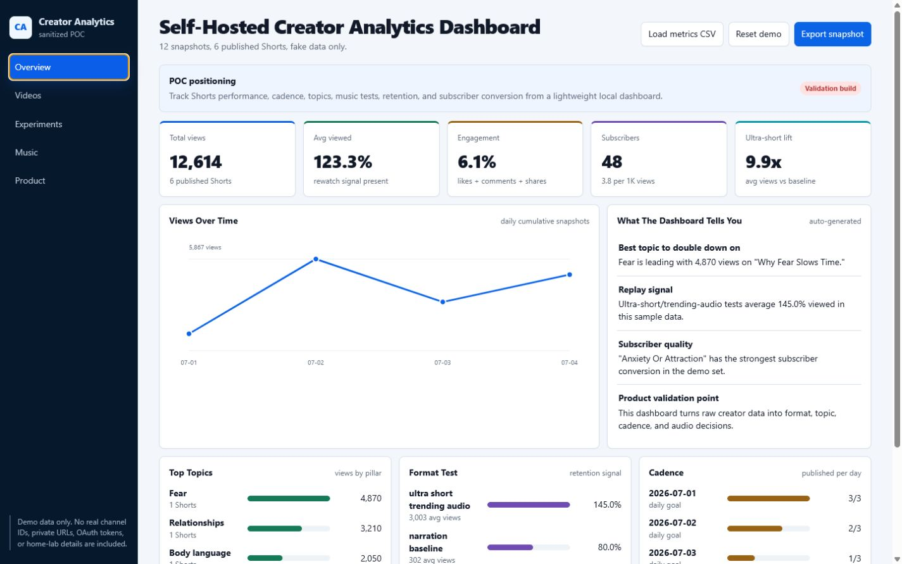
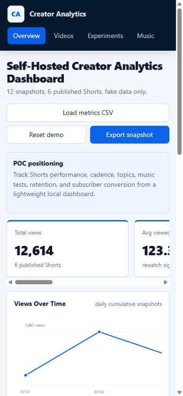

# Self-Hosted Creator Analytics Dashboard

A private-by-default, CSV-powered dashboard for creators who want to understand what to make next—not just watch view counts move.

This project is designed to validate demand for a paid automation pack without exposing any private home-lab details, real YouTube channel data, OAuth secrets, internal hostnames, or private network paths.



<details>
<summary>Mobile dashboard preview</summary>



</details>

## See The Signal Behind Your Shorts

This proof of concept turns a simple content ledger and performance snapshots into practical comparisons for:

- Shorts publishing cadence
- views, likes, comments, shares, and subscriber conversion
- average percent viewed
- topic/category performance
- ultra-short vs narration-first format tests
- music/audio experiments
- reusable CSV-based analytics history

## What This POC Does Not Do

This public POC does not:

- connect to a real YouTube account
- include OAuth credentials
- include private channel data
- scrape trending sounds
- promise viral growth
- expose any home-lab infrastructure

It uses fake sample data only.

## Try The Demo

Open:

```text
dashboard/index.html
```

The dashboard is a single static file. It runs locally, includes synthetic data, and requires no account or API credentials.

You can also serve the project locally:

```powershell
python -m http.server 8000
```

Then open `http://localhost:8000/dashboard/`.

Use **Load metrics CSV** to test your own sanitized export, **Reset demo** to restore the sample, and **Export snapshot** to download the active metrics.

## Folder Map

```text
creator-analytics-dashboard-poc/
  README.md
  .env.example
  config.example.json
  dashboard/
    index.html
  sample-data/
    content-ledger.csv
    performance-snapshots.csv
    upload-metadata.csv
  scripts/
    refresh-youtube-analytics.example.py
    install-scheduled-task.example.ps1
  deploy/
    docker-compose.yml
    kubernetes.example.yaml
  docs/
    setup.md
    product-validation.md
    security.md
    youtube-api.md
    troubleshooting.md
```

## Validation Goal

The purpose of this POC is to answer:

```text
Do small creators or self-hosted users care enough about this workflow to star, try, request, join a waitlist, or pay?
```

Signals worth tracking:

- GitHub stars
- README clicks
- issues/questions
- waitlist signups
- Gumroad/Lemon Squeezy preorder clicks
- comments from creator and self-hosted communities

The public-launch steps are in [`docs/launch-checklist.md`](docs/launch-checklist.md).

## Possible Paid Version

A paid version could include:

- YouTube API refresh script
- real OAuth setup guide
- daily scheduled snapshots
- Windows Scheduled Task installer
- Docker and Kubernetes deployment examples
- Homarr/homepage integration notes
- content ledger templates
- upload metadata templates
- troubleshooting guide

## Safety

Before publishing this project, run the checks in:

```text
docs/security.md
```

Never commit `.env`, token files, OAuth client secrets, logs, or private screenshots.
