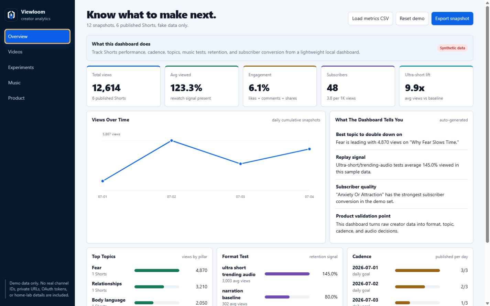
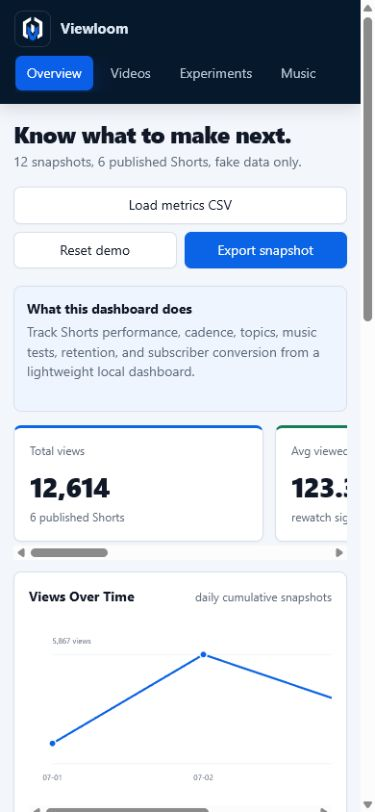

# Viewloom

**Self-hosted analytics for creators.**

Viewloom is a public demo of a private-by-default, CSV-powered workspace for creators who want to understand what to make next—not just watch view counts move.

Explore synthetic YouTube data, compare Shorts and standard videos, and evaluate the self-hosted workflow without connecting an account. No private home-lab details, real channel data, OAuth secrets, internal hostnames, or private network paths are included.

[**Open the live demo**](https://sc0528.github.io/viewloom/) · [**Become a tester**](https://github.com/sc0528/viewloom/issues/new?template=creator-feedback.yml) · [View the source](https://github.com/sc0528/viewloom)



<details>
<summary>Mobile dashboard preview</summary>



</details>

## See The Signal Behind Every Upload

Viewloom turns a simple content ledger and performance snapshots into practical comparisons for:

- Shorts and standard-video publishing cadence
- views, likes, comments, shares, and subscriber conversion
- average percent viewed
- topic/category performance
- format, length, hook, presentation, and narration tests
- music/audio experiments
- reusable CSV-based analytics history

## Current Status

This repository is a functional static demo using synthetic data. CSV import, reset, and export work locally. Automated YouTube API collection and scheduled refreshes are planned for a packaged edition and are not included here.

The public demo does not:

- connect to a real YouTube account
- include OAuth credentials
- include private channel data
- scrape trending sounds
- promise viral growth
- expose any home-lab infrastructure

It uses synthetic sample data only. The included workspace demonstrates a mixed YouTube channel with both Shorts and standard videos.

## Try The Demo

The fastest way to explore Viewloom is the hosted, synthetic-data demo:

**[Launch Viewloom →](https://sc0528.github.io/viewloom/)**

Nothing is connected to YouTube and no account is required. To run the same demo locally, open:

```text
dashboard/index.html
```

The dashboard is a single static file. It runs locally, includes synthetic data, and requires no account or API credentials.

You can also serve the project locally:

```powershell
python -m http.server 8000
```

Then open `http://localhost:8000/dashboard/`.

Use **Load metrics CSV** to test your own sanitized export, **Reset demo** to restore the sample, and **Export snapshot** to download the active metrics.

## Help Shape Viewloom

Viewloom is looking for creators who want a clearer way to compare Shorts and standard videos without sending channel data to another analytics service.

**[Become an early tester](https://github.com/sc0528/viewloom/issues/new?template=creator-feedback.yml)** if you are willing to share how you track performance today and what you would want automated. You can answer without posting channel names, URLs, or private analytics.

If the idea is useful but you are not ready to test, starring the repository is a simple signal that the project should continue.

## Folder Map

```text
viewloom/
  README.md
  .env.example
  config.example.json
  dashboard/
    index.html
  sample-data/
    content-ledger.csv
    performance-snapshots.csv
    upload-metadata.csv
  scripts/
    refresh-youtube-analytics.example.py
    install-scheduled-task.example.ps1
  deploy/
    docker-compose.yml
    kubernetes.example.yaml
  docs/
    setup.md
    product-validation.md
    security.md
    youtube-api.md
    troubleshooting.md
```

## Validation Goal

This early preview is also intended to answer:

```text
Do small creators or self-hosted users care enough about this workflow to star, try, request, join a waitlist, or pay?
```

Signals worth tracking:

- GitHub stars
- README clicks
- issues/questions
- waitlist signups
- Gumroad/Lemon Squeezy preorder clicks
- comments from creator and self-hosted communities

The public-launch steps are in [`docs/launch-checklist.md`](docs/launch-checklist.md).

## Possible Paid Version

A paid version could include:

- YouTube API refresh script
- real OAuth setup guide
- daily scheduled snapshots
- Windows Scheduled Task installer
- Docker and Kubernetes deployment examples
- Homarr/homepage integration notes
- content ledger templates
- upload metadata templates
- troubleshooting guide

## Safety

Before publishing this project, run the checks in:

```text
docs/security.md
```

Never commit `.env`, token files, OAuth client secrets, logs, or private screenshots.
